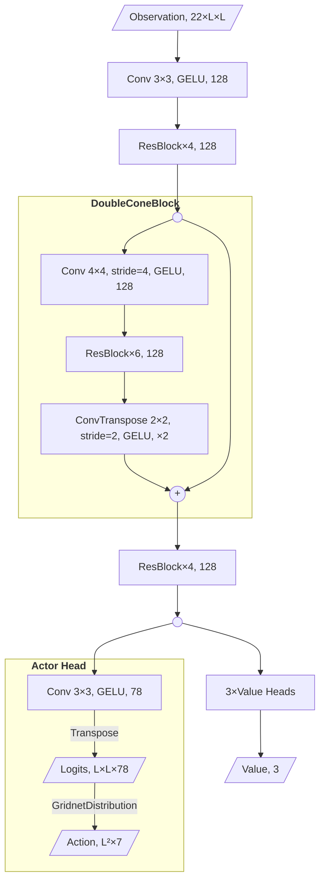
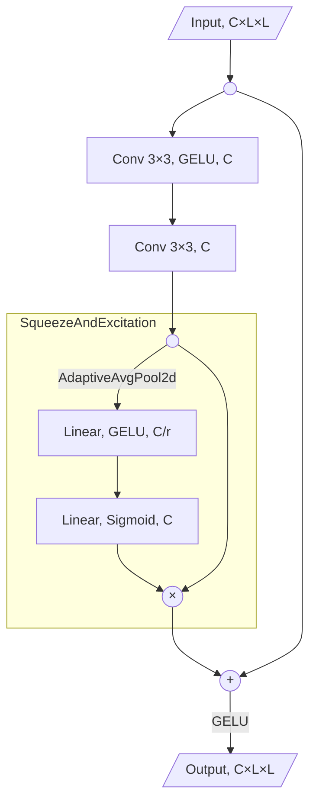
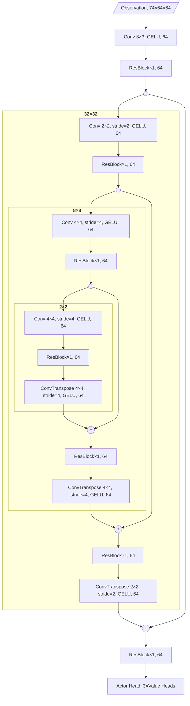

# Technical Description of IEEE-CoG2023 MicroRTS Submission

_Videos of the agent in action in [README](https://github.com/sgoodfriend/rl-algo-impls/tree/main/rl_algo_impls/microrts#videos-against-mayari-2021-cog-winner)._

## Agent Overview

RAISocketAI is a Java class that communicates with a Python process to determine
actions. RAISocketAI launches the Python process and uses pipes for writing requests and
read responses with the process.

The Python process loads up 7 different PyTorch models. During a match, only one model
is used based on the map:

- ppo-Microrts-finetuned-NoWhereToRun-S1-best: NoWhereToRun9x8
- ppo-Microrts-A6000-finetuned-coac-mayari-S1-best: All other maps of size 16x16 and
  smaller
- ppo-Microrts-finetuned-DoubleGame-shaped-S1-best: DoubleGame24x24
- ppo-Microrts-finetuned-DistantResources-shaped-S1-best: BWDistantResources32x32 if
  believed to complete within 75 milliseconds per turn
- ppo-Microrts-squnet-DistantResources-128ch-finetuned-S1-best: BWDistantResources32x32
  if the other model takes over 75 milliseconds per turn
- ppo-Microrts-squnet-map32-128ch-selfplay-S1-best: All other maps where the longest
  dimension is between 17-32
- ppo-Microrts-squnet-map64-64ch-selfplay-S1-best: Maps where the longest dimension is
  over 32

The tournament in the
[README](https://github.com/sgoodfriend/rl-algo-impls/blob/main/rl_algo_impls/microrts/README.md#win-loss-against-prior-competitors-on-public-maps)
used ppo-Microrts-finetuned-DistantResources-shaped-S1-best instead of
ppo-Microrts-**squnet**-DistantResources-128ch-finetuned-S1-best. The first 4 models
(non-squnet) use the same model architecture.
ppo-Microrts-A6000-finetuned-coac-mayari-S1-best (**DoubleCone**) was trained as a base
model, and the other 3 models were finetuned from the base model
on their specific maps (NoWhereToRun9x8, DoubleGame24x24, BWDistantResources32x32).

### DNN Architecture

The DoubleCone model is a reimplementation of the LUX Season 2 4th place winner's model [[1]](#FLG2023):

1. 4 residual blocks
2. A block with a stride-4 convolution, 6 residual blocks, and 2 stride-2 transpose
   convolutions with a residual connection.
3. 4 residual blocks
4. Actor and critic heads.

Each residual block includes a SqueezeAndExcitation layer.

The "squnet" models are similar to DoubleCone in the use of residual blocks with
squeeze-and-excitation and residual connections across convolution-deconvolution blocks.
However, squnet more mimics a U-net architecture through nested
convolution-deconvolution blocks to increase receptive field.

The table below shows the number of levels, residual blocks, strides, and other
statistics between the DoubleCone and squnet models:

|                               | DoubleCone                                                                               | squnet-map32¶ | squnet-map64     |
| ----------------------------- | ---------------------------------------------------------------------------------------- | ------------------------ | ---------------- |
| Levels                        | 2                                                                                        | 4                        | 4                |
| Encoder residual blocks/level | [4, 6]                                                                                   | [1, 1, 1, 1]             | [1, 1, 1, 1]     |
| Decoder residual blocks/level | [4]                                                                                      | [1, 1, 1]                | [1, 1, 1]        |
| Stride/level                  | [4]                                                                                      | [2, 2, 4]                | [2, 4, 4]        |
| Deconvolution strides/level   | [[2, 2]\*]                                                                    | [2, 2, 4]                | [2, 4, 4]        |
| Channels/level                | [128, 128]                                                                               | [128, 128, 128, 128]     | [64, 64, 64, 64] |
| Trainable parameters          | 5,014,865                                                                                | 3,584,657                | 1,420,625        |
| MACs†              | 0.70B (16x16)‡ 0.40B (12x12)§ 1.58B (24x24) 2.81B (32x32) | 1.16B (32x32)            | 1.41B (64x64)    |

¶Used by ppo-Microrts-squnet-DistantResources-128ch-finetuned-S1-best and ppo-Microrts-squnet-map32-128ch-selfplay-S1-best.
\*2 stride-2 transpose convolutions to match the 1 stride-4 convolution.
†Multiply-Accumulates for computing actions for a single observation.
‡All maps smaller than 16x16 (except NoWhereToRun9x8) are padded with walls up
to 16x16.
§NoWhereToRun9x8 is padded with walls up to 12x12.

All models have one actor head, which outputs an action for every location
(GridNet in [[2]](#Huang2021Gym)). Invalid action masking sets logits to a very large
negative number (thus zeroing probabilities) for actions that are illegal or would
accomplish nothing. All models have 3 value heads for 3 different value
functions:

1. Dense reward similar to [[2]](#Huang2021Gym), except reward for building combat units
   is split by combat unit type scaled by build-time. Identity activation.
2. Win-loss sparse reward at end of game. +1 for win, -1 for loss, 0 for draw. Tanh activation.
3. Difference in units based on cost, similar to [[3]](#Clemens2021). Identity activation.

These 3 value heads are used to mix-and-match rewards over the course of training,
generally starting with dense rewards using 1 and 3 and finishing with only win-loss
sparse rewards by the end. The value heads are strided convolutions (the number and
strides differ between DoubleCone and the squnet models) followed by a global average
pool and a couple of densely connected layers:

## PPO training

The Gym-μRTS paper [[2]](#Huang2021Gym) was used as a starting point, using GridNet and self-play. The
major differences from the paper:

- DoubleCone and squnet neural networks;
- using the sparse win-loss reward at the end of training;
- schedule to control reward and value weights, entropy, and learning rate;
- trained on multiple maps in a single training run;
- support training on different map sizes by padding with walls;
- various fixes for player 2 handling (critical for self-play);
- self-play could include training against older versions of own model;
- mask out additional actions caused by position being "reserved" by another unit either
  moving into or being created at the position;
- fine-tuning on other maps.

While training starts with the dense reward function, a sparse win-loss reward is used
by the end of training. The weights of rewards, value head weighing, entropy, and
learning rate was controlled through a schedule. The schedule specified phases where
these values are set. Transitions between phases occur linearly over a number of steps

The DoubleCone model used by ppo-Microrts-A6000-finetuned-coac-mayari-S1-best was
trained once and then fine-tuned repeatidly as improvements and fixes were made to the
model, environment representation, and training:

| Parameter                   |                                                                                                                                 Initial Training |     Shaped Fine-Tuning |     Sparse Fine-Tuning |
| --------------------------- | -----------------------------------------------------------------------------------------------------------------------------------------------: | ---------------------: | ---------------------: |
| Steps                       |                                                                                                                                             300M |                   100M |                   100M |
| n_envs                      |                                                                                                                                               24 |                      ″ |                      ″ |
| Rollout Steps Per Env       |                                                                                                                                              512 |                      ″ |                      ″ |
| Minibatch Size              |                                                                                                                                             4096 |                      ″ |                      ″ |
| Epochs Per Rollout          |                                                                                                                                                2 |                      ″ |                      ″ |
| Gamma                       |                                                                                                                 [0.99, 0.999, 0.999]† |                      ″ |                      ″ |
| gae_lambda                  |                                                                                                                   [0.95, 0.99, 0.99]† |                      ″ |                      ″ |
| Clip Range                  |                                                                                                                                              0.1 |                      ″ |                      ″ |
| Clip Range VF               |                                                                                                                                              0.1 |                      ″ |                      ″ |
| VF Coef Halving‡ |                                                                                                                                             True |                      ″ |                      ″ |
| Max Grad Norm               |                                                                                                                                              0.5 |                      ″ |                      ″ |
| Latest Selfplay Envs        |                                                                                                                                               12 |                      ″ |                      ″ |
| Old Selfplay Envs           |                                                                                                                                               12 |                      0 |                      ″ |
| Bots                        |                                                                                                                                             none | coacAI: 6 mayari: 6 | coacAI: 6 mayari: 6 |
| Maps                        | basesWorkers16x16A TwoBasesBarracks16x16 basesWorkers8x8A FourBasesWorkers8x8 NoWhereToRun9x8 EightBasesWorkers16x16\* |                      ″ |                      ″ |

″ Same value as cell to left.
† Value per value head (dense, sparse, cost-based).
‡ Multiply vloss by 0.5, [as done in CleanRL](https://github.com/vwxyzjn/cleanrl/blob/f62ad1f942890db7b752f4ad79b65be53917d3c2/cleanrl/ppo.py#L276).
\* Map not used in competition.

The initial training started from a randomly initialized model and trained with the
following schedule:

|                            |           Phase 1 | Transition 1→2\* |       Phase 2 | Transition 2→3\* |         Phase 3 |
| -------------------------- | ----------------: | --------------------------: | ------------: | --------------------------: | --------------: |
| Steps                      |               90M |                         60M |           30M |                         60M |             60M |
| reward_weights† | [0.8, 0.01, 0.19] |                             | [0, 0.5, 0.5] |                             | [0, 0.99, 0.01] |
| vf_coef†        |   [0.5, 0.1, 0.2] |                             | [0, 0.4, 0.4] |                             |   [0, 0.5, 0.1] |
| ent_coef                   |              0.01 |                             |          0.01 |                             |           0.001 |
| learning_rate              |              1e-4 |                             |          1e-4 |                             |            5e-5 |

\* Values are linearly interpolated between phases based on step count.
† Value per value head (dense, sparse, cost-based).

[The model outputted by initial training won 91%](https://wandb.ai/sgoodfriend/rl-algo-impls-benchmarks/runs/df4flrs4) of games on basesWorkers16x16A against
the same collection of opponents as [[2]](#Huang2021Gym). However, it only beat CoacAI
in less than 20% of games.

Additional trainings were done with each model using the prior model as the starting
point:

1. [Fine-tune against CoacAI using the following schedule that included cost-based rewards](https://wandb.ai/sgoodfriend/rl-algo-impls-benchmarks/runs/9bz7wsuv/overview)

|                |           Start | Transition →1\* |       Phase 1 | Transition 1→2\* |         Phase 2 |
| -------------- | --------------: | -------------------------: | ------------: | --------------------------: | --------------: |
| Steps          |                 |                         5M |           30M |                         20M |             45M |
| reward_weights | [0, 0.99, 0.01] |                            | [0, 0.5, 0.5] |                             | [0, 0.99, 0.01] |
| vf_coef        |   [0, 0.4, 0.2] |                            | [0, 0.4, 0.4] |                             |   [0, 0.5, 0.1] |
| ent_coef       |            0.01 |                            |          0.01 |                             |           0.001 |
| learning_rate  |            1e-5 |                            |          5e-5 |                             |            5e-5 |

2. [Fine-tune against CoacAI and Mayari using only sparse
   rewards](https://wandb.ai/sgoodfriend/rl-algo-impls-benchmarks/runs/tff7xk4b/overview)

|                |         Phase 1 | Transition 1→2\* |         Phase 2 |
| -------------- | --------------: | --------------------------: | --------------: |
| Steps          |             30M |                         40M |             30M |
| reward_weights | [0, 0.99, 0.01] |                             | [0, 0.99, 0.01] |
| vf_coef        |   [0, 0.5, 0.1] |                             |   [0, 0.5, 0.1] |
| ent_coef       |           0.001 |                             |          0.0001 |
| learning_rate  |            5e-5 |                             |            1e-5 |

3. [Fine-tune against CoacAI and Mayari to capture action mask improvements and adding a
   GELU activation after the stride-4
   convolution](https://wandb.ai/sgoodfriend/rl-algo-impls-benchmarks/runs/1ilo9yae).
   Used same schedule as above.

By the end of the fine-tuning, the model would win 98% of games on basesWorkers16x16A
including about 90% against each of CoacAI and Mayari.

### Map-specific fine-tuning

Using the ppo-Microrts-A6000-finetuned-coac-mayari-S1-best model as a starting point, 3
additional model weights were fine-tuned for 3 maps:

- NoWhereToRun9x8 ([shaped](https://wandb.ai/sgoodfriend/rl-algo-impls-benchmarks/runs/hpp5pffx)
  followed by [fine-tuning](https://wandb.ai/sgoodfriend/rl-algo-impls-benchmarks/runs/vmns9sbe/overview)):
  Was one of the training maps, but the model performed poorly on this map against
  advanced scripts like CoacAI and Mayari. The resources in the middle
  created a wall separating opponents, which the original model wasn't able to figure out.
- [DoubleGame24x24](https://wandb.ai/sgoodfriend/rl-algo-impls-benchmarks/runs/unnxtprk/overview):
  Larger map with a vertical wall through the middle, though a base for each
  player is on each side of the wall.
- [BWDistantResources32x32](https://wandb.ai/sgoodfriend/rl-algo-impls-benchmarks/runs/x4tg80vk/overview):
  Even larger map where resources are located far from the bases.

These would only train on the one map. Minibatch size was adjusted to fill available
GPU memory. The schedule was similar to the shaped reward schedule with more emphasis on
the original shaped reward vs the cost-based difference in units because cost-based
difference in units did not appear to be as effective a reward function. NoWhereToRun9x8
had an additional fine-tuning run using sparse rewards.

|                | Start           | Transition →1\* |         Phase 1 | Transition 1→2\* |         Phase 2 |
| -------------- | --------------- | -------------------------: | --------------: | --------------------------: | --------------: |
| Steps          | 5M              |                            |             30M |                         20M |             45M |
| reward_weights | [0, 0.99, 0.01] |                            | [0.4, 0.5, 0.1] |                             | [0, 0.99, 0.01] |
| vf_coef        | [0.2, 0.4, 0.2] |                            | [0.3, 0.4, 0.1] |                             |   [0, 0.5, 0.1] |
| ent_coef       | 0.01            |                            |            0.01 |                             |          0.0001 |
| learning_rate  | 5e-5            |                            |            7e-5 |                             |            1e-5 |

The resulting models exceeded 90% win-rate:

### squnet PPO training

The squnet models were trained because I was afraid DoubleCone would be too slow on
larger maps. For the submission, separate models were trained on maps up to 32 length (squnet-map32)
and up to 64 length (squnet-map64). The squnet-DistantResources model was a fine-tuning of the best
model from squnet-map32:

|                       |                                                       map32 |  map32-DistantResources |                            map64 |
| --------------------- | ----------------------------------------------------------: | ----------------------: | -------------------------------: |
| steps                 |                                                        200M |                    100M |                             200M |
| n_envs                |                                                          24 |                       ″ |                                ″ |
| rollout steps per env |                                                         512 |                     512 |                              256 |
| minibatch size        |                                                        2048 |                    2048 |                              258 |
| clip_range            |                                                         0.1 |                       ″ |                                ″ |
| clip_range_vf         |                                                        none |                       ″ |                                ″ |
| latest selfplay envs  |                                                          12 |                       ″ |                                ″ |
| old selfplay envs     |                                                           6 |                       6 |                                4 |
| bots                  |                                      coacAI: 3 mayari: 3 |  coacAI: 3 mayari: 3 |           coacAI: 4 mayari: 4 |
| maps                  | DoubleGame24x24 BWDistantResources32x32 chambers32x32 | BWDistantResources32x32 | BloodBath.scmB BloodBath.scmE |

[map32](https://wandb.ai/sgoodfriend/rl-algo-impls-benchmarks/runs/tga53t25) and
[map64](https://wandb.ai/sgoodfriend/rl-algo-impls-benchmarks/runs/nh5pdv4o/overview)
used a simplified training schedule to meet the competition deadline and because the middle phase didn't seem helpful.

|                |           Phase 1 | Transition 1→2\* |         Phase 2 |
| -------------- | ----------------: | --------------------------: | --------------: |
| Steps          |              100M |                         60M |             40M |
| reward_weights | [0.8, 0.01, 0.19] |                             | [0, 0.99, 0.01] |
| vf_coef        |   [0.5, 0.1, 0.2] |                             |   [0, 0.5, 0.1] |
| ent_coef       |              0.01 |                             |           0.001 |
| learning_rate  |              1e-4 |                             |            5e-5 |

[squnet-DistantResources](https://wandb.ai/sgoodfriend/rl-algo-impls-microrts-2023/runs/jl8zkpfr/overview)
used the same schedule as map-specific fine-tuning.

## Discussion: Large Maps

Given the 100 ms time limit and uncertainty of available hardware, I trained the squnet
models as smaller, quicker neural networks than DoubleCone. On limited hardware, such as 2 threads at 2.2 GHz (Google
Colab), DoubleCone took ~50 ms on a 16×16 map and ~450 ms on a 64×64 map. squnet-map32 has 30% fewer
parameters and makes 60% fewer multiply-accumulates on 32×32 maps compared to
DoubleCone. squnet-map64 has 60% fewer parameters and makes 90% fewer mulitply-accumulates
on 64×64 maps. squnet-map64 averages 70 ms per turn on Google Colab CPUs.

These speed gains came at the cost of model capacity. DoubleCone has 18 convolutional
layers at full map resolution (8 residual blocks plus input and output convolutions).
squnet has 6 (2 residual blocks). In total, DoubleCone has 16 residual blocks. squnet has 7.
squnet-64 uses only 64 channels instead of 128 used by DoubleCone and squnet-32.

While squnet-16 (not used in the competition) did learn to beat advanced scripts with 200
million steps of training, squnet-32 and squnet-64 managed only a 40% win-rate, never
beating CoacAI or Mayari.

squnet-DistantResources was able to learn better by fine-tuning from squnet-32's best
model and training on only one map. It achieved 85% win-rate, beating Mayari half the
time. It never beat CoacAI. In a similar round-robin tournament playing each of
WorkerRush, LightRush, CoacAI, and Mayari 20 times on
BWDistantResources32x32, the squnet model beat WorkerRush, LightRush, and Mayari better
than even, but not CoacAI:

| Architecture | POWorkerRush | POLightRush | CoacAI | Mayari | Map Total |
| ------------ | ------------ | ----------- | ------ | ------ | --------- |
| DoubleCone   | 1            | 0.85        | 0.95   | 1      | 0.95      |
| squnet-32    | 0.85         | 0.45        | -0.55  | 0.15   | 0.22      |

On the largest 64x64 map, DoubleCone also couldn't win. One issue
is that DoubleCone has a 48×48 receptive field (DoubleConeBlock has 12 3×3 convolutions
at 4x down-scaled resolution).

Given the above, my next model architecture has more residual blocks than DoubleCone,
but does a second 4x down-scaling to get a 128×128 receptive field:

|                                 | deep16-128      |
| ------------------------------- | --------------- |
| Levels                          | 3               |
| Encoder residual blocks/level   | [3,2,4]         |
| Decoder residual blocks/level   | [3,2]           |
| Stride per level                | [4,4]           |
| Deconvolution strides per level | [[2,2],[2,2]]   |
| Channels per level              | [128, 128, 128] |
| Trainable parameters            | 5,429,201       |
| MACs† (16x16)        | 0.48B           |
| MACs† (64x64)        | 7.61B           |

†Multiply-Accumulates for computing actions for a single observation.

Despite 7.61B MACs being 40% less than DoubleCone, this is 4x squnet-64, which itself
was borderline performance-wise. However, this is an ideal testbed to see if PPO can
reasonably train on 64×64 (and possibly 128×128) maps.

Since DoubleCone successfully fine-tuned on DistantResources32x32 from 16×16 training,
my plan is to first train a model on 16×16 maps, where it can learn tactical small-scale
strategies. Next, fine-tuning on larger maps where it can transfer the micro to then
focus on learning long-distance strategies. So far, training with the above 200M step
schedule on 16×16 maps has over 90% win-rate with over 80% win-rates against CoacAI and Mayari.

## References

<a name="FLG2023">[1]</a> FLG. (2023). FLG's Approach - Deep Reinforcement Learning with a Focus on Performance - 4th place. Kaggle. Retrieved from https://www.kaggle.com/competitions/lux-ai-season-2/discussion/406702

<a name="Huang2021Gym">[2]</a> Huang, S., Ontañón, S., Bamford, C., & Grela, L. (2021).
Gym-μRTS: Toward Affordable Full Game Real-time Strategy Games Research with Deep
Reinforcement Learning. arXiv preprint
[arXiv:2105.13807](https://arxiv.org/abs/2105.13807)

<a name="Clemens2021">[3]</a> Winter, C. (2021, March 24). Mastering Real-Time Strategy Games with Deep Reinforcement Learning: Mere Mortal Edition. Clemens' Blog. Retrieved from https://clemenswinter.com/2021/03/24/mastering-real-time-strategy-games-with-deep-reinforcement-learning-mere-mortal-edition/
